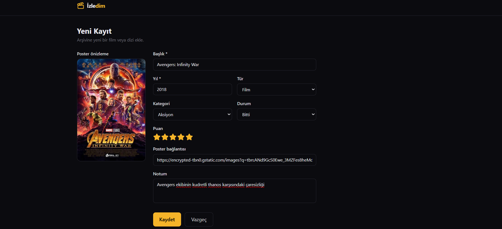
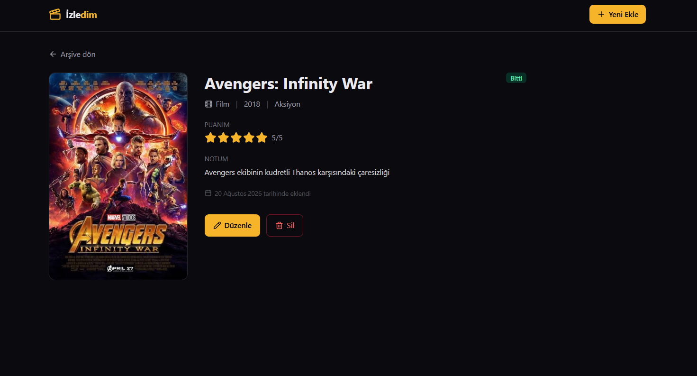
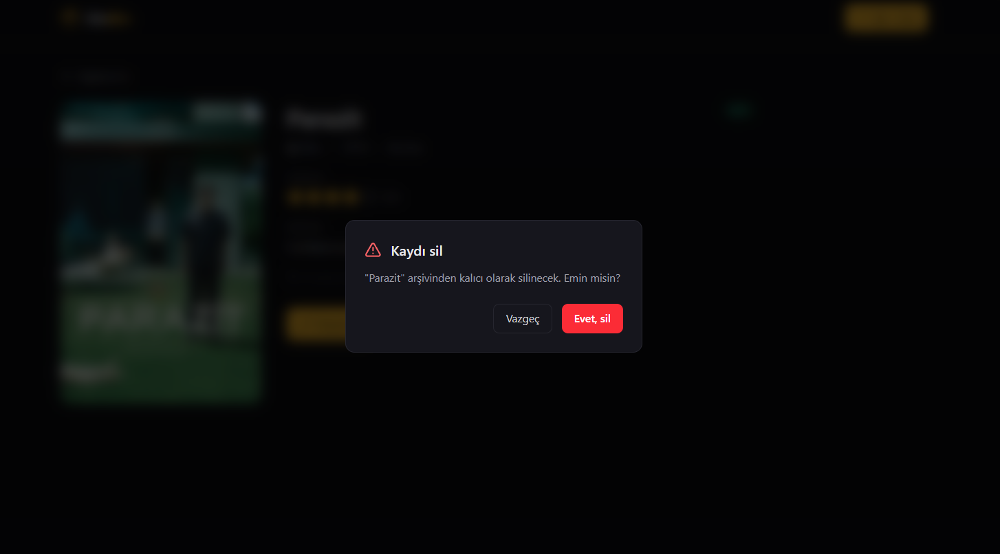
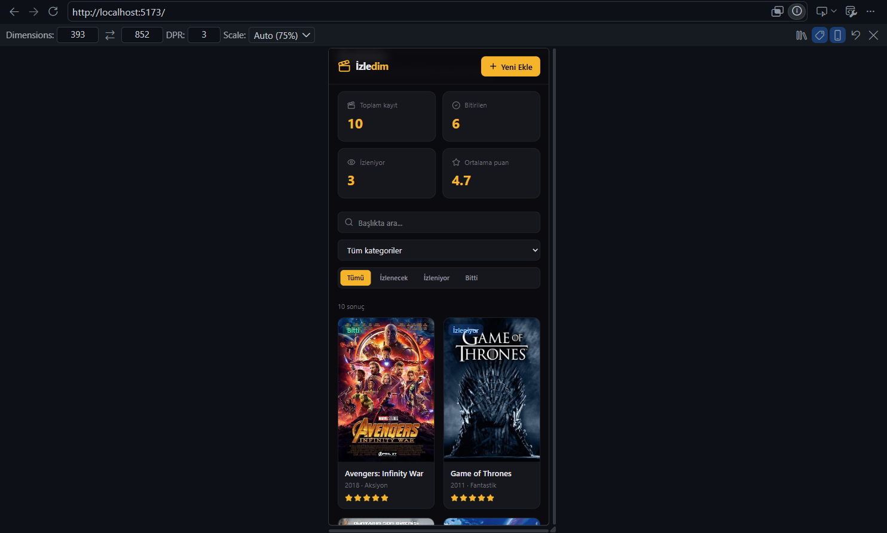

# 🎬 İzledim — Film & Dizi Arşivi

İzlediğiniz ve izleyeceğiniz film/dizileri kaydedebileceğiniz, puanlayabileceğiniz ve filtreleyebileceğiniz bir React uygulaması. Tüm veriler tarayıcının LocalStorage'ında saklanır; sunucu veya veritabanı gerektirmez.

**Canlı demo:** [NETLIFY_LINKI_BURAYA]

---

## Özellikler

- **Ekle** — film veya dizi kaydı oluşturma (başlık, yıl, tür, kategori, durum, puan, poster, not)
- **Listele** — poster kartlarından oluşan duyarlı ızgara görünümü
- **Güncelle** — mevcut kayıtları düzenleme
- **Sil** — onay penceresiyle güvenli silme
- Başlıkta canlı arama (Türkçe karakter uyumlu)
- Duruma ve kategoriye göre filtreleme
- 5 yıldızlı puanlama sistemi
- Toplam kayıt, bitirilen, izlenen ve ortalama puan istatistikleri
- Verilerin LocalStorage ile kalıcı saklanması
- Mobil uyumlu koyu tema

---

## Kullanılan Teknolojiler

| Teknoloji       | Amaç                        |
| --------------- | --------------------------- |
| React 19        | Arayüz kütüphanesi          |
| TypeScript      | Tip güvenliği               |
| Vite            | Geliştirme ve derleme aracı |
| Tailwind CSS v4 | Stillendirme                |
| React Router    | Sayfa yönlendirme           |
| lucide-react    | İkonlar                     |
| LocalStorage    | Veri saklama                |

---

## Kurulum

```bash
# Projeyi klonlayın
git clone https://github.com/Maliyldz/izledim.git

# Klasöre girin
cd izledim

# Bağımlılıkları yükleyin
npm install

# Geliştirme sunucusunu başlatın
npm run dev
```

Tarayıcıda `http://localhost:5173` adresini açın.

Üretim derlemesi için:

```bash
npm run build
npm run preview
```

---

## Klasör Yapısı

```
src/
├── components/     # Tekrar kullanılabilir arayüz bileşenleri
├── pages/          # Rotalara karşılık gelen sayfalar
├── interfaces/     # TypeScript tip tanımları
├── context/        # Global state ve CRUD işlemleri
├── hooks/          # Özel React hook'ları
└── utils/          # Sabitler ve örnek veri
```

---

## Ekran Görüntüleri

### Ana Sayfa


### Yeni Kayıt Ekleme



### Detay Sayfası



### Silme Onayı



### Mobil Görünüm



---

## Geliştirici

Mehmet Ali YILDIZ — Software Persona Yazılım Mesleki Gelişim Web Geliştirme Bitirme Projesi, 2026
